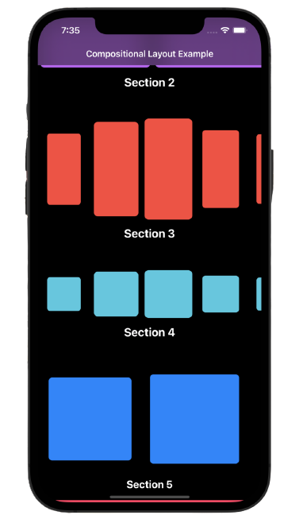

# Compositional Layout

***A layout object that lets you combine items in highly adaptive and flexible visual arrangements.***
</br>

## Declaration

```Swift
@MainActor class UICollectionViewCompositionalLayout : UICollectionViewLayout
```

## Overview

***Compositional layout*** is a type of collection view layout. It's designed to be composable, flexible, and fast, letting you build any kind of visual arrangement for your content by combining — or compositing — each smaller component into a full layout. </br>

***Compositional layout*** is composed of one or more sections that break up the layout into distinct visual groupings. Each section is composed of groups of individual items, the smallest unit of data you want to present. A group might lay out its items in a horizontal row, a vertical column, or a custom arrangement. </br>

<p align="center">
  
  
</p>

## Usage

You combine the components by building up from items into a group, from groups into a section, and finally into a full layout, like in this example of a basic list layout: </br>

```Swift
func createBasicListLayout() -> UICollectionViewLayout { 
    let itemSize = NSCollectionLayoutSize(widthDimension: .fractionalWidth(1.0),                         
                                          heightDimension: .fractionalHeight(1.0))
                                             
    let item = NSCollectionLayoutItem(layoutSize: itemSize)  
    
    let groupSize = NSCollectionLayoutSize(widthDimension: .fractionalWidth(1.0),                        
                                           heightDimension: .absolute(44)) 
                                             
    let group = NSCollectionLayoutGroup.horizontal(layoutSize: groupSize,                                                                             subitems: [item])  
  
    let section = NSCollectionLayoutSection(group: group)    

    let layout = UICollectionViewCompositionalLayout(section: section)    
    return layout
}
```


