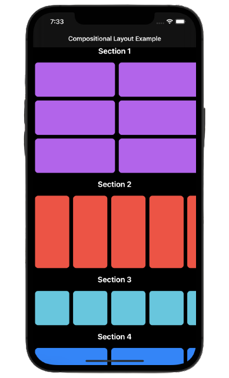

# Compositional Layout

1. Overview  

A compositional layout is a type of collection view layout. It's designed to be composable, flexible, and fast, letting you build any kind of visual arrangement for your content by combining — or compositing — each smaller component into a full layout.  

A compositional layout is composed of one or more sections that break up the layout into distinct visual groupings. Each section is composed of groups of individual items, the smallest unit of data you want to present. A group might lay out its items in a horizontal row, a vertical column, or a custom arrangement.  

  
  

